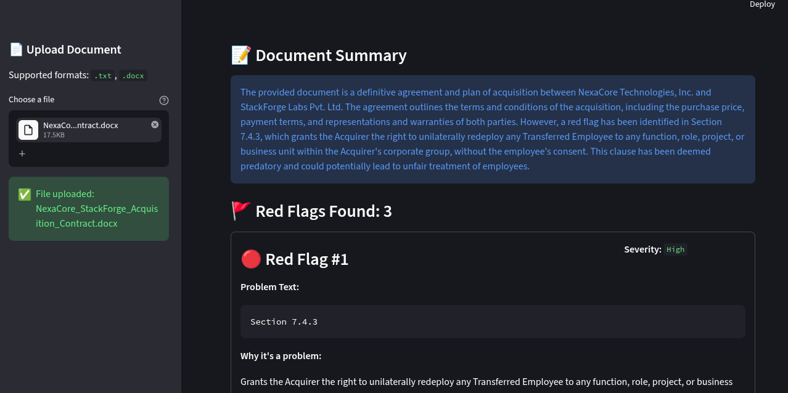

# 🚩AI Red Flag Analyzer

Red Flag Analyzer is a Streamlit application that scans uploaded text and Word documents for risky or unfair contract terms. It uses an AI-powered document risk analysis agent to identify red flags, classify their severity, and explain why they may be problematic.

## Preview


## Features

- Upload `.txt` or `.docx` documents
- Extracts document text and previews content
- Uses AI to detect red flags such as:
  - unfair clauses
  - hidden fees
  - high-risk commitments
  - ambiguous terms
  - legal risk factors
- Displays severity-coded findings with reasoning
- Includes a user disclaimer reminding that this is not legal advice

## Project Structure

- `app.py` - Streamlit user interface and document upload workflow
- `main.py` - AI red flag analyzer logic using `pydantic-ai`
- `pyproject.toml` / `requirements.txt` - Python dependency definitions

## Requirements

- Python 3.13+
- `streamlit`
- `pydantic`
- `pydantic-ai`
- `python-docx`
- `python-dotenv`

## Setup

1. Create a virtual environment and activate it.
2. Install dependencies:

```bash
pip install -r requirements.txt
```

3. Create a `.env` file with your AI provider credentials. Example:

```env
GROQ_API_KEY=your_groq_api_key_here
```

> Keep API keys private and do not commit `.env` to version control.

## Run the app

```bash
streamlit run app.py
```

Then open the local Streamlit URL in your browser, upload a document, and click `Analyze for Red Flags`.

## Notes

- This tool is intended for awareness and document review support only.
- It is not a substitute for professional legal advice.
- The AI agent is configured in `main.py` with the model `groq:llama-3.3-70b-versatile`.

## License

This project is released under the terms of the [MIT License](LICENSE).
